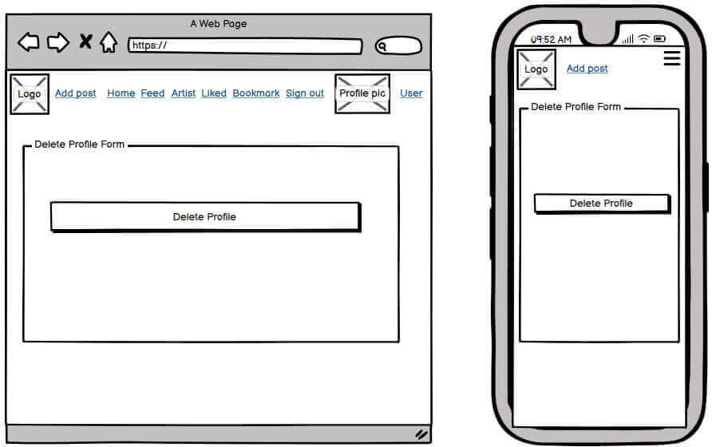

# Artistery Avenue

Artistry Avenue is a social media platform designed for artists and art enthusiasts that aims to create a vibrant and interactive online community for artists and art enthusiasts, providing a platform for sharing, appreciation, and connection within the art world. The platform incorporates diverse features and functionalities encapsulated within distinct applications, each catering to specific aspects of the artistic experience.

It is a website where Users can share the artwork they have made, give feedback to others,  like, and connect.


## Live Project
- The live website can be found [here](https://th-1982-artistery-avenue-react-7bb24beffb04.herokuapp.com/)

## Purpose of the website:
- To offer artists and art enthusiasts a platform to share their artwork, including posts, pictures, and comments.
- To establish and nurture a vibrant community of users with shared interests in the art world.
- To facilitate connections and interactions among artists and art enthusiasts.
- To serve as a creative hub and a starting point for personal and future artistic projects.

## Set Goals
- To develop a fully functional and specialized social media platform tailored for artists and art enthusiasts.
- To prioritize user accessibility, interaction, and control over their artistic content and data.
- To establish and cultivate a thriving artistic community on the platform, encouraging creating and sharing creative content, including imagery.

## Design:
The website was designed to ensure users can easily browse through various posts, artworks, and creative content within the platform.
The website prioritizes a navigation system, allowing users to access all components easily. This includes straightforward paths to CRUD functionalities for managing their Posts, Comments, Likes, and Profiles.
The Users are also empowered to perform all CRUD functionalities, such as creating, reading, updating, and deleting their Posts, Comments, Likes, and Profiles. This capability enhances user control and customization.
In addition to standard CRUD operations, Users incorporate specialized functionalities for CRU Reviews and Wall messages. This caters to the unique needs of the artistic community by fostering detailed reviews and interactions on user profiles.

Rather than prioritizing aesthetics like structure and colors, the developer's efforts are geared towards creating more components and their functionality and arranging them accordingly.

# Wireframes
Full size wireframes available [here](https://github.com/th-1982/artistery-avenue/tree/main/readme/wireframes)

- **Read a Post on /home /feed /Artist /liked /Bookmarks**


- **Create & Update a Post**


- **Update the Profile**


- **Creat a Contact**


- **Read a Profile**


- **Sign Up**


- **Sign In**


- **Update the Username**


- **Update the Password**


- **Artist List** 


- **Delete the Profile**



- **Create Artist and Update Artist**


## Colour-Scheme

The Main Page Background is  An off-shade of white (#f8f8f8) that provides a clean and neutral backdrop for the platform's main content.
The Component Backgrounds for Individual Components, such as Navbar, Footer, cards, or sections, feature an Eerie Black background (#191717), adding a touch of depth and contrast to the overall design. 
Icons, Headings, Buttons, and Borders colors are Jonquil (#FFCC00), the primary color for icons, headings, buttons, and borders. This vibrant yellow hue adds a pop of color, ensuring essential elements stand out and creating a visually engaging interface.
The Main Text White (#ffffff) is used for the main text, ensuring readability and a clean look against the off-white background.
The Sign-In and Sign-Up Links are Atomic Tangerine (#ffAF8A), providing a distinct and eye-catching color for these critical actions.
Combining Eerie Black, Jonquil,  White, and Atomic Tangerine creates a balanced and aesthetically pleasing color palette for the Artistery Avenue social media platform.


## Fonts

The main font used on this website is "DM Sans, " a modern and versatile sans serif typeface. "DM Sans" contributes to a readable and cohesive user experience, ensuring that text elements are both aesthetically pleasing and easily accessible to users. This font choice reflects the platform's commitment to a modern and user-friendly design. 

## Logo

The website logo was taken and made using the [free Artistery Avenue logo website](https://www.bing.com/search?pglt=41&q=free+artistery+avenue+logo+for+social+media+plateform&cvid=989244342f2c40288dd88319fc43288f&gs_lcrp=EgZjaHJvbWUyBggAEEUYOdIBCTM0NDIxajBqMagCALACAA&FORM=ANNTA1&PC=EDGEDSP )  to ensure seamless integration with the platform's overall design and color scheme. 

# Components, Functionality & Reusability:
This project includes several functional and reusable React components that are used for different parts of the application. Below are the key components:

# Navbar, Header & Favicon
The Navbar, situated at the top of the page, functions as a pivotal navigation menu crucial for guiding users seamlessly throughout the platform. It has been meticulously designed to optimize user experience and encourage engagement. The arrangement, from left to right, includes the 'Logo,' 'Add post' (available for logged-in users), 'Home,' 'Feed,' 'Artist,' 'Liked,' 'Bookmark,' 'Sign Out,' and 'Profile.' For users not logged in, the options are 'Home,' 'Sign in,' and 'Sign up.' Users can effortlessly navigate these components by clicking on the corresponding icons. A hover effect provides visual feedback, and the cursor transforms into a pointer, signaling the accessibility of each feature. Additionally, a Favicon has been implemented, contributing a branded and easily recognizable icon for the platform within browser tabs.

Logged in users:


Logged out users:


# Posts
Users on Artistery Avenue can create posts (when authenticated) by selecting "Add post" next to the logo. They upload an image and provide a title and brief content. Upon clicking Create/Submit, the post appears on the "/" or "Home" page for the community. Authors have control, being able to Edit or Delete posts via a dropdown menu with Pencil and Bin icons. Posts support engagement through likes/dislikes, comments, and bookmarking/unbookmarking, fostering an active community and user interaction.

- ## Post.js
- The component in the Artistery Avenue social media platform is a dynamic renderer for individual posts, displaying crucial details such as the owner's profile image, title, content, and associated functionalities.
- Allows Users to seamlessly navigate the post details page by clicking on the post image or title, providing an intuitive and user-friendly experience.
- The component handles essential actions based on user permissions, including like, unlike, edit, delete, bookmark, and unbookmark functionalities. These actions contribute to a dynamic and interactive user experience.
- Users can quickly assess post-engagement metrics, such as the number of likes, comments, and bookmarks, facilitating community interaction and participation.

- ## PostCreateForm.js
- This component facilitates the creation of new posts by allowing users to input a title and content and upload an image.

- ## PostEditForm.js
- This component facilitates editing existing posts, allowing users to modify their post details, including title, content, and image upload.

- ## PostPage.js
- This component is utilized to display a single post along with its associated comments.
- It fetches and presents detailed information about the post and enables authenticated users to create comments. 
- The component also displays existing comments and supports infinite scrolling for enhanced user experience.

- ## PostsPage.js
- This component displays a list of posts featuring infinite scrolling for additional posts. 
- Users can search for posts based on a provided query through a well-designed search bar.
- Provides a layout that includes sections for popular profiles, search bar, and community comments, creating a dynamic and engaging user experience. Additionally, a dedicated wall section for wall posts allows users to create and view new wall posts.


# Likes
Likes on Artistery Avenue allow authenticated users to express appreciation for posts by leaving likes and removing them (dislikes) as well. The like counter adjusts by +1 or -1 with each user interaction, ensuring it remains above 0. However, post owners are restricted from liking or disliking their own posts.


# Bookmark
Once authenticated, Users on Artistery Avenue can bookmark and unbookmark posts, showcasing their interest. The bookmark counter adjusts by +1 or -1 per user interaction, ensuring it remains above 0. Post owners are restricted from bookmarking or unbookmarking their posts.


# Comments

Authenticated users on Artistery Avenue can engage with posts by providing feedback and participating in discussions. This functionality promotes meaningful interactions, encouraging users to engage actively in discussions related to posted content. This feature enables users to share thoughts and contribute to the community dialogue. Comments support actions such as editing and deleting, similar to Posts.
Users click the Dialogue icon on the Post page to comment and access existing comments. The Comment section's input form allows users to submit comments, displaying a warning for empty submissions. Successful submissions show a confirmation message; the form is hidden to prevent spamming.

- ## Comment.js
- This component is designed to render individual comments, including owner details, content, and timestamps within the app.
- Provides or offers key functionalities for displaying, editing, and deleting comments and utilizes the MoreDropdown component for additional actions like editing and deleting.
- To use this component, one must import it and pass it in rendering comments within the app.

- ## CommentCreateForm.js
- This component is dedicated to crafting new comments within the app. It features a user-friendly form with a text area, facilitating effortless comment input.
- axiosRes API is used to make requests to the backend, ensuring robust communication.
Offers users clear visual feedback, displaying alerts for successful comment creation and warnings for empty submissions.
- To integrate this component, import it and seamlessly include it in rendering forms for comment creation within the app.

- ## CommentEditForm.js
- This component is dedicated to editing existing comments within the app.
- Renders a form with a textarea, allowing users to modify their comments. Users can choose to either update the comment or cancel the edit.
- To integrate this component, import the CommentEditForm component and include the component in rendering comment edit forms within the app.


# Footer
Located on the right panel, just below the  "Latest/Users Comments" (Home/Profile) and SignIn/Up (Components), the footer serves as a quick access point. The "Contact" component, social media links, and a "Terms of Service" modal — all represented by user-friendly icons — streamline navigation for enhanced user experience.

- ## Footer.js
- This component is responsible for rendering the footer section of the web app. 
- It offers contact information and quick-access links to social media platforms. Additionally, it features a modal for viewing the "Terms of Service." 
- To incorporate this component into your app, import and include it in your layout for the seamless footer display.


# Wall
Presented at "/" or "Home," the Wall component is the first component rendered on the right side of the page. The wall component encourages users to create/update messages for community interaction. Resembling a chat room, users can utilize this space for casual conversations. To engage, users open the Wall form on the Home page, write a message, and click submit. A warning prompts a retry on unsuccessful submissions. Successfully submitted messages trigger a confirmation message, with the form and submit buttons hidden to prevent spamming.

- ## WallPost.js
- The component was designed for displaying and managing wall posts. It offers functionality for both viewing and editing wall posts.
- To integrate this component, import it and provide the necessary props. The component includes features for editing and saving wall posts, enhancing the user experience.

- ## WallPostCreateForm.js
- Component designed for creating new wall posts. It features a user-friendly form where users can write and submit wall posts.
- To integrate this component, import it and provide the required props, including `profiling`, `createWallPost`, and `currentUser`. The component handles form submission and error handling, allowing users to contribute to the community wall seamlessly.

- ## WallPostsList.js
- The component is designed to display a list of wall posts. It fetches wall posts from an API and continuously updates them every second.
- To integrate this component, import and pass the `profileId` and `currentUser` props. It renders a list of wall posts and provides a collapsible interface for viewing them.


# Contact
The "Contact" component facilitates user communication with the administration panel for addressing platform-related issues. Authentication is not required. Users are prompted to input a valid email*, and a username, specify the subject of concern, and provide the message they wish to send to the Support team. Upon successful submission, users receive a notification confirming the message has been sent.

- ## ContactCreateForm.js
- Component used for creating and submitting comments on posts. It provides a form with an input field for users to enter their comments. The form is linked to the "axiosRes" API for making requests to the backend.
- To use this component, import it and include it in rendering comment creation forms within the app. Users can write comments, and the component handles form submission, updating the comments section and displaying appropriate messages.

- ## ContactSuccessForm.js
- The component displays a success message when a contact form is successfully submitted. It includes a thank you message and an indication that a staff member will respond soon.
- To use this component, import it and include it in your app to show a customized success message after a user successfully submits a contact form.


# Terms of Service
When users click the "Terms of Service" link in the Footer, a modal will appear, presenting the "~~legal agreementss~~" between Artistry Avenue and individuals using the service. The modal will persist until users acknowledge and agree to the terms by clicking the designated button at the end.

- ## TermsOfService.js
- The "TermsOfService" component displays the Terms of Service for Artistry Avenue. When users click the "Terms of Service" link in the footer, a modal presents the "~~legal agreements~~" between Artistry Avenue  and service users. The modal remains open until users explicitly agree to the terms by clicking the designated button.
- To use this component, import it and pass the `isOpen` (to control modal visibility) and `onRequestClose` (to handle modal closing) props.


# Signin
The "SignIn" component facilitates user logins on Artistery Avenue's social media platform. Once users have successfully created an account, they can access their user accounts by utilizing the Sign In component. This allows them to perform CRUD functionalities within the platform and engage with the community. To sign in, users are prompted to enter their login credentials, including their Username and Password, which they previously created during the sign-up process. The Sign-in page features a user-friendly form and an accompanying image. Although the image is currently static and reflects a summer theme, there are plans to implement dynamic changes based on the season (currently unapplied). To use the Sign In component, users navigate to the Sign In page, input their credentials, and gain access to the platform's features and community interactions. 


# Signup 
To become an integral part of the vibrant Artistry Avenue community, users are required to create an account. This involves a straightforward process where users input their desired Username and Password and confirm the Password before hitting the "Sign Up" button. Upon completing this process, users gain access to the platform's features and interactions with the community. A user-friendly Sign-Up form and an accompanying image characterize the sign-up page. The image maintains a static summer theme; however, plans are in place to introduce dynamic changes based on the season (though this feature is currently unapplied). To register and join the Artistry Avenue community, users navigate to the Sign Up page, input the required information, and click the "Sign Up" button. Once completed, they can log in using the provided credentials through the Sign In component.


# Profile
Upon successfully creating a user account and completing the authentication process, users gain access to their personalized "Profile" on Artistery Avenue. The User Profile is a comprehensive overview of a user's activity within the platform, showcasing their latest Posts and Comments. Additionally, it provides valuable insights into their network by displaying the number and list of Followers and Followings. Whether you are the profile owner or a visitor, the User Profile offers a convenient way to stay updated on the latest actions and maintain a seamless connection with your network. Users can effortlessly track their recent activity, monitor posts and comments, and stay informed about the engagement of their followers. The Profile component enhances the user experience, fostering community and connection on Artistery Avenue. 

- ## Profile.js
- The "Profile" component is designed to display user profiles with optional buttons for follow/unfollow actions, contributing to a user-friendly and interactive experience on Artistery Avenue.
- Utilizing the `useCurrentUser` and `useSetProfileData` hooks from the context, the component accesses current user data and manages profile-related actions seamlessly. 
- It efficiently handles the rendering of follow/unfollow buttons based on ownership and relationship status, enhancing the overall functionality of the platform.
- To integrate this component, import the "Profile" component and pass the necessary profile data as props. This enables users to view profiles and, if applicable, perform follow/unfollow actions directly from the profile display.

- ## ProfilePage.js
- The "ProfilePage" component is a comprehensive module designed to showcase user profile pages on Artistery Avenue. Leveraging various custom components such as Asset, Post, ProfileEditDropdown, FollowingProfiles, FollowedProfiles, FilteredComments, ProfileReviews, ReviewCreateForm, and Footer, it ensures a feature-rich and interactive user experience.
- Utilizes InfiniteScroll to dynamically load more posts, enhancing the user's browsing experience.
- Implements the `useEffect` hook to fetch profile data and associated posts efficiently, ensuring accurate rendering.
- Renders follow/unfollow buttons based on the relationship between the current user and the profile owner.
- Displays a customizable profile page, including user details, posts, and follow-related statistics.
- Utilizes a modal confirmation for deleting an artist profile, enhancing user control and experience.
- To integrate this component, import the "ProfilePage" component and render it within the app. This allows for seamless display and interaction with user profile pages on the Artistery Avenue social media platform.

# Edit Profile, Change Username, Update Password, Delete Profile
Authenticated profile owners on Artistery Avenue enjoy comprehensive control. They can effortlessly edit user handles and avatars, update passwords, or delete profiles. Each functionality is conveniently accessible from the user's profile dropdown menu, providing total control and flexibility.

- ## ProfileEditForm.js
- The `ProfileEditForm` component is a crucial tool for users to update their profiles on Artistery Avenue. 
- It seamlessly integrates with the API through `axiosReq,` utilizing context hooks from `CurrentUserContext` to manage user data efficiently. 
- The state, `profile data,` encompasses essential fields such as name, content, and image, ensuring a comprehensive user editing experience.
- To implement this feature, import and render `ProfileEditForm` in your app, providing users with a streamlined profile editing process.


- ## UsernameForm.js
- `UsernameForm` is a component designed for updating user usernames. 
- It utilizes `axiosRes` for API requests and depends on context hooks from `CurrentUserContext` for efficient user data management. 
- To integrate this functionality, import and render `UsernameForm` within your app, providing users with a straightforward way to change their usernames.


- ## ProfileDeleteForm.js (BUGGED)
- `ProfileDeleteForm` is a component designed for eliminating user profile accounts. 
- Upon confirmation, the component triggers an asynchronous request to delete the user's profile. The `handle delete` function, responsible for this deletion process, ensures that the user is appropriately logged out by removing the access token and updating the current user context.If the user does not want to delete their account, they should click on their profile at the top right-hand side of the Navbar, which will take them back to their profile.
- **BUGGED:** Please refer to the TESTING.md linked at the end of this README.md.


This component seamlessly integrates into the user settings or profile page, providing a user-friendly way for individuals to manage their account preferences on Artistery Avenue. Adhering to a clean and minimalist design, it follows the application's visual style defined by `app styles` and `button styles.` Importing this component into the desired location within the React application allows users to interact effortlessly with the profile deletion functionality.

# Reviews
The Artist Review and Rating System allows users to leave reviews and ratings seamlessly through an accessible form. The cumulative effect of these reviews is skillfully portrayed in the average rating displayed on the artist's profile, offering both individual reviews and an overall assessment. This comprehensive system enhances user engagement and provides valuable insights into the community's perception of each artist. A visually intuitive star rating component simplifies the rating process for users.

- ## Review.js
- The Review component on Artistery Avenue presents user feedback and ratings with a clean, structured layout.
- Displayed in the artist's profile, it showcases user-generated reviews and ratings.
- Integrates `Avatar` for profile images and a dynamic `Rating` component for visual appeal.
- Components like `Media` and `Link` contribute to a pleasing and navigable design.
- Encourages engagement by linking back to the reviewer's profile.
- The Review component enhances the Artistry Avenue user experience, offering concise yet comprehensive insights.

- ## ReviewUpdateForm.js
- The ReviewCreateForm component facilitates the creation of reviews on Artistery Avenue. 
- Users can rate and write reviews using the integrated form.
- Utilizes the `Rating` component for a user-friendly star-rating input.
- Manages form submission, validation, and error handling seamlessly.
- To integrate, pass the required props such as `profile_id,` `createReview,` and `currentUser.`
- The ReviewCreateForm component enhances user engagement by providing an easy-to-use interface for sharing feedback on the platform.

- ## ReviewsPage.js
- The ReviewsPage component on Artistery Avenue manages and displays artist reviews. 
- It leverages InfiniteScroll for seamless loading and integrates components like PopularProfiles and Artist for additional context. 
- To use this component, import ReviewsPage into your React application. Pass necessary props, such as the message for no reviews. 
- Integrate ReviewsPage to enhance user experience with artist reviews and popular profiles. 


# Artists
Aspiring artists on Artistery Avenue can effortlessly share their creative journey and connect with users by registering as artists. This feature enables them to showcase their unique specialties, location, hourly rates, and contact details, fostering a vibrant community where users can explore diverse artworks and stay updated on their favorite artists. Artists can seamlessly register by accessing the dropdown menu on their profile page and selecting "Register as Artist." This action directs them to an intuitive form to input essential details.

- ## Artist.js
- Displays the artist's profile picture, specialty, location, email, and phone contact information.
- Showcases the artist's average rating through a user-friendly star rating component.
- Allows users, excluding the profile owner, to leave reviews effortlessly.
- Offers the option to explore all reviews or leave a review based on the context.
- Import and integrate the Artist component into relevant application sections for effective artist representation and user interactions.


- ## ArtistCreateForm.js
- The ArtistCreateForm component in Artistry Avenue facilitates the creation of new artist profiles, allowing users to share details about their work and contact information.
- Users can access the artist registration form through their profile page by clicking the three dots and choosing "Register as Artist."
- The form captures specialty, location, email, and phone number information for comprehensive artist profiles.
- Upon submission, the form triggers database requests to create a new artist and update the user's profile with the associated artist ID.
- Error handling ensures a smooth user experience by displaying validation messages for form submission issues.
- To integrate this component, import and render it within the application, providing an intuitive pathway for artists to register and showcase their details.

- ## ArtistPage.js
- The ArtistsPage component in Artistry Avenue is designed to showcase artists, providing a dynamic and engaging platform for users.
- Users can explore a curated list of the most followed profiles, enhancing discoverability and user engagement.
- The component integrates a search functionality allowing users to find artists by name, location, or specialty. The search results dynamically update as users type, ensuring a responsive and user-friendly experience.
- Artists are presented in a visually appealing layout, featuring essential details such as profile image, name, specialty, location, and follower count.
- Infinite scrolling is implemented to seamlessly load more artists as users scroll down, promoting continuous exploration.
- The component offers a comprehensive overview of artists, encouraging users to discover and follow profiles based on their preferences.
- To integrate this component, import and render it within the application, providing users with an immersive experience exploring the diverse range of artists on Artistery Avenue.


# Follow
Users (when authenticated) can follow/unfollow others, staying updated with their followers' posts. The "Feed" tab displays chronological posts from all followings. The following actions are convenient and available on user profiles, and the PopularProfiles component counts increments accordingly on the user's Profile page.

# Popular Profiles
The PopularProfiles component, accessible on "/," "/home," "/feed," "/artist," "/like," and "/bookmark," prominently displays the top 10 most active profiles in the community. This component allows users to explore and follow these influential individuals. By featuring active profiles, the component motivates less popular profiles to increase engagement, contributing to a dynamic environment and facilitating user connections.

- ## PopularProfiles.js
- PopularProfiles.js is a versatile component designed to showcase popular profiles within the Artistry Avenue social media platform. It serves as a dynamic element, giving users visibility into the most followed individuals within the community.
- Utilizes the useProfileData hook to access and display popular profile data from the profile context.
- To integrate this component, developers must import PopularProfiles and incorporate it into the desired section of the application.


# Followers & Following
This exclusive component, found solely on a user's Profile page, showcases a truncated list of up to 5 users for both followers and followers. It provides a quick overview of the users following the profile and those whom the profile is following.

- ## FollowedProfiles.js
- FollowedProfiles.js is a versatile component designed to showcase a profile list that follows a specific user.
- Utilizes the axios library to fetch profiles following the specified user, dynamically handling paginated data.
- Fetches detailed information about each profile, enhancing the display with additional details.
- Responsive to different screen sizes, providing an optimal viewing experience.
- Utilizes a collapsible section, allowing users to toggle the visibility of the follower list.
- To implement this component, one must import FollowedProfiles and pass the followedId as a prop.

- ## FollowingProfiles.js
- FollowingProfiles.js is a versatile component designed for rendering profiles that a specific user follows.
- Utilizes the axios library to fetch profiles followed by the specified user, dynamically handling paginated data.
- Fetches detailed information about each followed profile, enhancing the display with additional details.
- Adapts to different screen sizes, ensuring an optimal viewing experience.
- Implements a collapsible section, allowing users to toggle the visibility of the following profiles list.
- To implement this component, one must import the following profiles and pass the ownerId as a prop.


# Filtered Comments by User & Community Comments
Respectively, the Filtered Comments & Community Comments components render in the Profile page and "/" accordingly. Filtered Comments lists all comments & details submited by a user to a list of posts from latest to oldest. Ergo, for each comment a link is attributted to the post of a comment, if a user wishes to read the parent Post.

- ## SnipetComments.js
- This component is utilized to present user comments in a concise snippet format.
- It requires the following properties: profile_id, profile_image, owner, updated_at, content, and post.
- To integrate this component, import it and provide the necessary props to showcase user comments in a snippet format.

- ## CommunityComments.js
- Component used to display the latest comments from the community. It fetches comments from an API and displays them in a chat-like format.
- To use this component, import it, and it will automatically fetch and display the latest comments from the community.

- ## FilteredComments.js
- Component used to display filtered comments based on a specific profileId. It fetches comments from an API and filters them by profileId.
- To use this component, one must import import it and pass the profileId prop. It will automatically fetch and display comments related to the specified profile.


- Community Comments lists all comments & details submited by all users to a list of all posts from latest to oldest. Ergo, for each comment a link is also attributted to the post of a comment, if a user also wishes to read the parent Post.


- Due to the vast volume of components and possible distractions that may cause a user to be confused... to keep the space organized and clean, users can toggle on and off the content for its components visibility, when clicking its respective icon/title.


# Features & Functionality

## Features and Functionlity for Reg. Non-Registered Users:
- Visitors can read all posts from "/".
- Visitors can read all users' posts from /profiles/(id)/.
- Visitors can create a user account through /signup/.
- Visitors can navigate to the "/", "/signin", "/signup", "/profiles/(id)", and "/contact" pages.
- Visitors can access external links on users' posts/comments and in the Footer.
- Visitors can send messages to the admin panel via the contact form, from /contact/.
- Visitors can view  Artists.
- Visitors can view bookmark post

## Registered Users (CRUD) can do the above as a Visistor, moreover:
- Users can sign in/out through the "/sign in" and "/sign out" options on the NavBar.
- Users can create posts through the "posts/create" component available on the NavBar.
- Users can update their posts through the "/posts/(id)/edit" functionality available in the MoreDropdown menu inside the Post.
- Users can delete their posts through the "Delete" functionality in the MoreDropdown menu inside the Post.
- Users can Like/Dislike all posts through the "Like/Dislike" functionality under the Post. (Users cannot use this functionality for their Posts)
- Users can navigate to their profiles.
- Users can update their Profile Bio and profile Picture in "Edit Profile" (/profiles/(id)/edit) from the Dropdown menu.
- Users can update their Username in "Change Username" (/profiles/(id)/edit/username) from the Dropdown menu.
- Users can update their Password in "Update Password" (/profiles/5/edit/password) from the Dropdown menu.
- Users can delete their profiles by clicking "Delete Account" from the Dropdown menu. (Bugged).
- Users can create Wall posts via the Wall component at "/."
- Users can update their Wall posts via their posts on the Wall.
- Users can create Reviews on each other's profiles (/profiles/(id)/).
- Users can update their Reviews from their reviews associated with a profile via a profile page.
- Registered Users can view detailed profiles of registered artists, contact details.
- Registered users can bookmark posts to save and revisit them later.
- Registered users can view all the posts they have bookmarked.
- Registered users can remove a bookmark from a post.

## Future Features
- **Private Messaging System**: Implementation of a messaging system to allow users to message artists privately.

- **Artist Gallery Area**: Inclusion of a gallery area for each artist to showcase their designs and finished works of art, grouped as journeys.

- **Real-time Chat System**:
Implement a real-time chat system to allow users to communicate instantly. Use technologies like WebSocket for efficient, low-latency communication.

- **Privacy Controls**:
Users can keep their bookmarked collections private or share them publicly, fostering community and collaboration.

- **Backend Handling**:
Develop backend logic to handle the storage and retrieval of downloadable files. This involves setting up a secure and scalable storage system.

- **Download API Endpoints**:
Create API endpoints that allow users to request and download artwork. Ensure these endpoints are secure, and consider implementing rate-limiting to prevent abuse.


## Planning & Agile

This [project](https://github.com/users/th-1982/projects/13/views/1) was planned using Agile methodology and MoSCoW prioritization.

For this purpose, the project was illustrated by [11 initial Milestone](https://github.com/th-1982/artistery-avenue/milestones?state=closed) entitled "Navigation & Authentication", "Profiles", "Artists", "Posts", "Likes", "Comments", "Walls", "Reviews", "Contacts", "Bookmarks", and "Miscellaneous" providing the developer with the freedom to accomplish all issues/tasks flexibly before dates deadline set to March. The Milestones were broken according to their component's names.

Throughout the development process, tasks started from "Todo," progressing to "In Progress," and finally, "Done." The issues were assigned to the sole developer and labeled as "could-have," "should have," "must-have," "wont-have," and "bugged."

## Must-Have 
- Edit profile
- profile page
- Create a comment
- Post page
- View a post
- Create posts
- Conditional rendering
- Refreshing access tokens
- Logged Status
- Sign in
- Authentication -Sign up
- Routing
- Navigation
- Create a Wall post
- View Community Wall
- View profile Reviews
- Create profile Review
- Artist-Centric API Views Development for Seamless Front-End Integration
- View Artist Profiles (Artists) 
- Bookmark a post
- View bookmarked posts
- Contact site owner
- Favicon

## Should-Have:
- Footer
- Feedback via Contact
- Navigation to Contact us
- Update user credentials
- View all posts by a specific user
- View comments
- Edit post
- Search for posts
- View latest posts
- Like a post
- Update Artist Profile (Artists)
- Filter Artists (Artists):
- Avatar
- Update a Wall post
- Update a profile Review
- Remove a bookmark

## Could-Have:
- Pop the modal for the Terms of Service
- Render the following profiles to a profile
- Render Followed profiles to a profile
- Read filtered comments by user
- Read community comments could-have
- Follow/Unfollow a user profile 
- User profile - user stats could-have
- Most followed profiles could-have
- Edit a comment could-have
- Delete comments could-have
- Comment Date could-have
- Infinite scroll could-have
- View posts of followed users could-have
- View like posts could-have
- Search for Artists (Artists):
- Update contact reason
- Delete Profile(bugged)

## Won't-Have (Bugged)
- Delete Artist Profile (Artists):
- Delete Profile bugged (bugged)

## Testing
- Testing can be found in the [TESTING.md](https://github.com/th-1982/artistery-avenue/blob/main/TESTING.md)


## Development & Deployment
- From the begining of development, the project started out and continued from the tutorial provided by Code Institute "Moments" unit on the "Advanced Front-end specialization" module.

The project was developed using GitHub and GitPod platforms...
- Navigate to: "Repositories" and create "New".
- Mark the following fields: ✓ Public ✓ Add a README file.
- Select template: "Code-Institute-Org/python-essentials-template".
- Add a Repository name: "digital-nomads".
- ...and create Repository.

... and suffered various executions using the inbuild Terminal.

For Commits on this project, the following commands ran:
- ```git add .``` <- Stages before commiting.
- ```git commit -m "written imperative declaration"``` <- Declares changes and updates.
- ```git push``` <- Push all updates to the GitHub Repository.

Through development the following commands ran:
- ```npm install``` <- Installs Reacts dependencies
- ```npm run start``` <- Runs the app in local environment

Additionally, the following:
- ```npm install react``` <- Installs React library. JavaScript library for building user interfaces.
- ```npm install react-router-dom``` <- Installs React Rounter DOM. Library for handling navigation and routing in React applications.
- ```npm install axios``` <- Installs Axios library. Library used for making HTTP requests.
- ```npm install react-bootstrap``` <- Installs React Bootstrap. Library components that have been re-implemented using React.
- ```npm install react-modal``` <- Installs Pop up Modal. Library for using modal dialogs and pop-up windows.
- ```npm install react-simple-star-rating``` <- Installs Rating Star for reviews. Library for costumizing a star rating component in React.

The database is being hosted on ElephantSQL:
- Create an account(with GitHub) and select TinyTurtle plan.
- From Details collect the URL and paste it on Heroku Config Var.

The static files are being hosted on Cloudinary:
- Create and account (with GitHub)
- From the dashboard collect the API Environment variable and paste it on Heroku Config VAR.

...and hosted on Heroku:
- After creating an Heroku Free account, and applying for Student Pack
- Navigate to: "Create new app" add a unique name "th-1982-artistery-avenue-react" and select "Europe" region. Click "Create App"
- Head over to "Settings" tab and apply the respective config VARs
- Move to "Deploy" section and select "Github" method"
- From here search for the repository name "th-1892/artistery-avenue", from the GitHub account.
- Hit "th-1892/artistery-avenue" and "Enable Automatic Deploys" to keep the the repository in parallel to Heroku.
- Manually "Deploy Main Branch".
- Upon successful deployment, retrieve the link for the mock terminal.
- The live app can be found [here](https://th-1982-artistery-avenue-react-7bb24beffb04.herokuapp.com/).

## Languages & Frameworks (Front-end)
- HTML (markup language)
- CSS (style sheet language)
- Bootsrap (CSS framework)
- React Boostrap (CSS framework on React components)
- React (javaScript Library)

## Languages & Frameworks (Back-end)
- DjangoRESTFramework (python framework)

## Other forms of development
- [Google Fonts](https://fonts.google.com/) - Source of fonts
- [FontAwesome](https://fontawesome.com/) - Source of icons
- [Bytes.dev](https://bytes.dev/) - Testing screen sizes
- Chrome DevTools - Testing tool
- [W3jigsaw](https://jigsaw.w3.org/css-validator/) - CSS validation tool
- [JSHint](https://jshint.com/) - Javascript testing tool
- [Lucidchart](https://www.lucidchart.com/) - Diagramming and visualization tool 
- [Github](https://github.com/) - Host for the repository
- [Gitpod](https://gitpod.io/workspaces) - Code editor
- [ElephantSQL](https://www.elephantsql.com/) - Database
- [Cloudinary](https://cloudinary.com/) - Static & Media host
- [TinyPNG](https://tinypng.com/) - Image compression tool
- [Heroku](https://id.heroku.com/login) - Cloud platform/Host the live project


## Credits

### Media 
- The images on this website were taken from [pexels](https://www.pexels.com).
- The website logo was taken from [free-artistery-avenue-logo](https://www.bing.com/search?pglt=41&q=free+artistery+avenue+logo+for+social+media+plateform&cvid=989244342f2c40288dd88319fc43288f&gs_lcrp=EgZjaHJvbWUyBggAEEUYOdIBCTM0NDIxajBqMagCALACAA&FORM=ANNTA1&PC=EDGEDSP ). 
- I got the mockup Generator form [Mockup-Generator](https://techsini.com/unable-to-generate-mockup-of-your-website-here-is-the-quick-fix/)


### Code

The following sources and references were resorted for the creation of this website:

- The lessons and tutorials provided by Code Institute, on the final module entitled "Moments" for the 'Advanced Front-End' specialization
- The Tutor team provided by Code Institutes Student Support
- The mentor Gareth McGirr for [react-simple-star-rating](https://react-simple-star-rating.vercel.app/?path=/story/introduction--page) and his examplar repo [body-doodles](https://github.com/Gareth-McGirr/body-doodles/tree/main).
- This README file and some of the Code were also taken and guided by the README file from [TiagoMA90](https://github.com/TiagoMA90/connect) and my mentor Gareth McGirr exemplar repo [body-doodles-api](https://github.com/Gareth-McGirr/body-doodles).
- [React](https://legacy.reactjs.org/docs/getting-started.html) documentation
- [React Bootstrap](https://react-bootstrap.netlify.app/) documetation

### Acknowledgements

I would like to thank:
- My mentor Gareth McGirr for his help, feedback, advice, guidance and support.
- The Tutor team provided by Code Institutes Student Support
- Slack(#project-portfolio-5-advanced-frontend) as a solution platform for broken code and guidance on how to procceed to blockades
- My Family, for their encouragement and support along the way.


