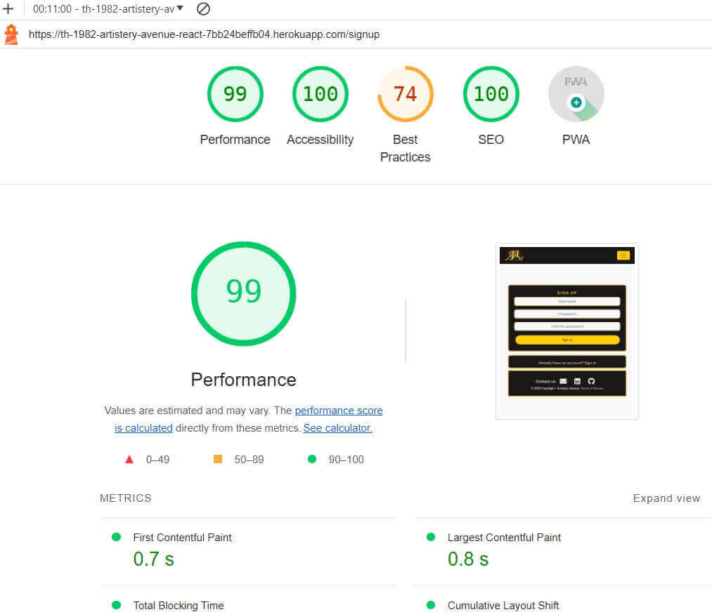

# Testing:
Testing has been performed for its overall purpose.
The website has proven to exhibit dynamic functionality and responsive interactivity, both in the Front & Back-End.
After consecutive rehearsals and manual testing, the website employed the desired role and met the final goal set by the developer.

Based on the solid foundations of CRUD, testing was performed:
- By navigating and accessing links on the website.
- By Creating, Reading, Updating, and Deleting an account for a registered user. (Deleting: Bugged/Unsolved)
- By Creating, Reading, Updating, and Deleting posts of a registered user.
- By Creating, Reading, Updating and Deleting comments on a post as a registered user.
- By liking and unliking a post as a registered user.
- By following and unfollowing a post as a registered user.
- By Creating, Reading, Updating comments on the community wall as a registered user.
- By Creating, Reading reviews and ratings on a user profile as a registered user.
- By Creating, Reading, Updating artist profile as a registered user.
- By Creating a message to the moderators via the contact form.
- By Populating the components (Posts, Walls, Following Profiles/Followed Profiles) to activate infinite Scrolling.
- By inputting and retrieving results from the search box.
- By Updating the username, bio, password and image of a registered user, if authenticated.
- By manipulating posts, users, comments, artists, bookmarks, likes, followers, contacts, walls, reviews as a superuser in the Admin panel.
- By bookmark and unbookmark a post as a registered user.

## Functionalities
- By clicking on "Home" or the logo located in the NavBar, users are sent to the homepage, where a list of posts can be found, with the latest being retrieved on top. From here, users can browse posts via scroll down and select one to read.
- By clicking on "Feed," users are sent to the Feed page, where logged in users can then retrieve a list of posts for all the users the authenticate user is following.
- Users can view the list of Artists, contact details, ratings, and number of reviews by clicking on an Artist in the Navigation Bar.
- By Clicking on the Artist link in the Navbar as a Registered User, a page displaying the most followed profiles and a list of registered artists should appear. Users should be able to drop reviews for artists on this page, and Artists should be able to receive reviews from users when viewed as an artists.
- By clicking on "Liked," users are sent to the Liked page, where logged in users can then retrieve a list of posts for all the liked posts, initially liked by the authenticated user.
- By clicking on "Bookmark," users are sent to the Bookmark page, where logged in users can then retrieve a list of posts for all the Bookmark posts, initially bookmark by the authenticated user.
- By clicking on "Profile," users are sent to the Profile page, where one can Read all the user activity ( including: Posts, number of Posts, number of Followers, list of Followers), number of Followings, list of Followings, all Comments created by this particuar user. If the visitor of thie profile is the owner and is authenticated, then the owner may Update (the username, bio, password and profile image) & Delete the profile (unresolved).
- Inside the Profile page, Users may Edit their Username, Profile Picture, Bio, Password, register as artist and Image by clicking the three dots available at the upper right corner of the component. Users can also Delete the Profile by clicking the "Delete Profile" Button. Once the Profile is deleted the account is eliminated along with the Posts, Comments, Wall posts, Reviews, Bookmarks, artist profile, Follower & Likes associated with that particular account.
- By accessing the "Reviews" component located in artist's profile of a user... authenticated users can Create a Review in a artist's profile. Reviews once created cannot be deleted. Rather, user can Created or Updated their own reviews on content and rating.
- By clicking on Artist in the Navbar, users can create a Review in the Artist's profile by clicking on Leave a review, input content and rating, and click Save.
- By inputting words in the Seach box, Users may filter Posts according to a set of characters. Posts are automatically retrieved if a Post contains words in the Title or Body. Users may click on a post, after retrieved, in order to open and read it.
- By clicking on "Sign Up", users are sent to the Sign Up Form page. In that page, users may give in a Username and Password(2/2) in order to create an account. Once the submit "Sign Up" button is clicked, the account is created and Users may log in to their User account.
- By clicking on "Sign In", users are requested to use their credentials (Username & Password) to access their User accounts. Once "Log in" is clicked, Users are in and can start CRUDing functionalities withing the website.
- By clicking "Sign Out", users are logged out from their accounts.
- By clicking on "Post," users are redirected to the Post Form, where they must input a title & body to create a Post. Posts are submitted by clicking the Submit Button. (Users must be logged in to post.)
- Once a post has been successfully created, it can be accessed and read by the entire community.
- Authors of that particular Post can Read, Update and Delete thie posts. Respectively, these functionalities are achieved by clicking the associated icons at the three dots available inside of the Post page, the "Pencil" and "Bin". Additionally Like/Unlike is restricted to non-authors of the Post, but to authenticated users only as is the creating and updating a Comment. Bookmark/Unbookmark is restricted to non-authors of the Post, but to authenticated users only as is the creating and updating a Comment. Authenticated users can also make use of the Bookmark function, by clicking the "Bookmark" next to the "Heart" and "Comment" icons.
- By clicking the Like/Unlike buttons, inside of a Post, the amount of likes should be incremented and decremneted accordingly to that post. the number should be displayed in the lower section of the post.
- By clicking the Bookmark/Unbookmark buttons, inside of a Post, the amount of bookmarks should be incremented and decremneted accordingly to that post. the number should be displayed in the lower section of the post.
- By clicking the Follow/Unfollow buttons on a user profile or most followed profiles component, the amount should be displayed in a users profile, together with a list of Followers and Followings. Only registered and logged in users can use this functionality.
-By clicking on "Profile," Users may register as an artist by clicking the three dots available at the upper right corner of the component. Users can fill in their contact details, including content, location, email address, and contact phone number, and click Create, and the user is registered as an artist.
-Users may filter Artists according to name, location, or specialty by inputting words in the Search artist. Artists are automatically retrieved if they contain words in the Title or Body. Users may click on an Artist to open and read it after retrieving it.
By clicking on "Artist's Profile," users are sent to the Artist's Profile page, where one can Read all the artist's activity ( including Posts, number of Posts, number of Followers, list of Followers), number of Followings, list of Followings, all Comments created by this particular artist on this artist's profile. If the visitor of this profile is the owner and is authenticated, then the owner may Update (the username, bio, password, and profile image) and delete the profile (unresolved).
- By clicking on the Contact logo "Letter", displayed in the footer, users are redirected to a contact form, where one is requested to input the e-mail address. One may also write the Name, Subject and Message. This component is free for all, hence, users are not requested to be autheticated. Rather anyone, including visitors may use this functionality.
- Users may write messages on the Walls component. Users need to be logged in in order to submit a message. Once submitted, owners of the message may also alter or update the content of the message. Messages cannot be deleted, only Created and Updated.
- By clicking on the Terms of Service, displayed on the footer, users are faced with a modal, forcing users to read it. The modal should disapear once the button is clicked.

## Manual testing
Manual testing has been performed by exploiting test case scenarios.

| Scenario | Case | Condition | Steps | Expectation | Result | Mark |
| ------------- | ------------- | ------------- | ------------- | ------------- | ------------- | ------------- |
| Visit the Home page | Click on Home link | Reg./Non-Reg. Users | - On the navbar of the webite click on Home | Opens the Homepage in the same page | The Home page is open | Approved |
| Visit the Feed page | Click on Feed link | Registered Users | - On the navbar of the website click on Feed | Opens the Feed page in the same page | The Feed page is open and displays a list of Posts from Users a User is following | Approved
| Visit the Liked page | Click on Liked link | Registered Users | - On the navbar of the website click on Liked | Opens the Liked page in the same page | The Liked page is open and displays a list os Posts a user liked | Approved 
| Visit the Bookmark page | Click on Bookmark link | Registered Users | - On the navbar of the website, click on Bookmark | Opens the Bookmark page on the same page | The Bookmark page is open and displays a list of Posts a user Bookmarked | Approved   
| Visit the Sign up page | Click on Register link | Reg./Non-Reg. Users | - On the navbar of the website click on Sign up | Opens the Sign up page in the same page | The Sign up page is open | Approved  
| Register a User account | On the Sign up page, input the requested credentials and click Sign Up | Reg./Non-Reg. Users | - Input the Username/Password1/Password2 -> Click Sign Up | Creates an User account | A User account is created | Approved  
| Visit the Sign in page | Click on Sign in link | Reg./Non-Reg. Users | - On the navbar of the website click on Sign in | Opens the Sign in page in the same page | The Sign in page is open and allows Users to log in | Approved  
| Visit the a Profile page | Click on Profile link | Registered Users | on the NavBar click on Profile | Opens a User profile page in the same page | A Profile page is open | Approved  
| Log into a User account | On the Sign in page input the Login credentials and hit Sign in | Registered Users | - Input the login credentials(Username/Password) -> Click Sign in | Logs the User | The User is logged in | Approved   
| Sign out from a User profile account | Click on Sign out link | Registered Users | On the navbar of the website click on Sign out | Logs the User out | The User is signed out | Approved  
| Upload a User Profile picture | Upload a Profile picture | Registered Users |  Click on Profile -> Click on "Edit Profile" from the 3 dots and upload a picture from your local device -> Click the Save button | Updates the User profile picture | The User profile picture is updated | Approved  
| Update the User Profile Username/Bio/Password | On the User profile, update the given Username, Bio and Password | Registered Users | Click on the User Profile -> click the 3 dots -> Choose either "Edit Profile", "Change Username", "Update Password" -> Click the save button | Updates the User details | The User profile details is updated  | Approved  
| Delete a User Profile account | From the User profile click the 3 dts and hit Delete Account | Registered Users | Access the User profile -> Click Delete Profile -> Confirm by clicking Delete | Deletes the User account | The User account is eliminated | Approved (**bugged**)  
| Register as Artist  | From the User profile, click the three dots and hit Register as Artist | Registered Users | Input your Content, Location, Email Address, and Contact Number -> Click Create  | Artist Profile Created  | Approved  
| Read/View a Registered Artist || Click on the "Artist" link in the Navbar  | Registered Users | A page displaying the most followed profiles and a list of registered artists should appear. |Users should be able to drop reviews for artists on this page. | Artists should be able to receive reviews from users when viewed as an artist. | Approved 
| Use the Search Artist | On the Search Artist box, enter a valid keyword | Reg. Users | Click on the Artist on the Navbar |  Enter a keyword or character on the Search Artist by Name, Location, or Speciality | Automatically retrieves a list of Artists containing a valid keyword | A list of Artists containing a valid keyword is retrieved | Approved  
| Use the Search Box | On the Searchbox, enter a valid keyword | Reg./Non-Reg. Users | Enter a keyword or character | Automatically retrieves a list of Posts containing a valid keyword | A list of Posts containing a valid keyword is retrieved | Approved  
| Visit a User Profile | Click the a users Username | Reg./Non-Reg. Users | - From a list of posts &/or Most followed profiles -> Click on an authors Username | Accesses a User profile | The User profile is accessed | Approved  
| Create a Post | Click on "Add post"" | Registered Users | On the navbar click on "Add post" -> Input the Title* and Content* fields and upload a picture from the local device -> Click Create | Creates a Post visible at "/" / "Home" | A Post is created | Approved  
| Read/Open a Post | Click on a Post to open | Reg./Non-Reg. Users | - From Home and the list of Posts displayed on the same page, click on the Post | Opens a truncated Post | A Post is open | Approved 
| Update a Post | Click on Update | Registered Users | Inside of a Post click on the Edit icon "Pencil" from the 3 dots -> Edit the Title, Description or Image of the Post -> Click on Update | Updates a User-Post Title*, Content* or Image* | A Post is updated | Approved  
| Delete a Post | Click on Delete | Registered Users | Inside of a Post click on the Delete icon "Bin" from the 3 dots | Deletes a User-Post | Deletes a Post | The Post is Deleted | + | Approved  
| Write a Comment | Click on Add a Comment | Registered Users | - From inside of a populate the Comment form -> Write the body of a Comment -> Click on Submit | Automatically adds a Comment to a Post | A Comment is added to a Post | Approved  
| Like/Dislike a Post | Click on the Like Icon | Registered Users | From a inside of a Post click on the Like icon "Heart" (to like) &/or click again (to unlike) | Likes/Dislikes a Post | A Post is Liked/Disliked | Approved 
| Bookmark/Unbookmark a Post | Click on the Bookmark Icon | Registered Users | From inside of a Post, click on the Bookmark icon "Bookmark" (to bookmark) &/or click again (to unbookmark) | Bookmark/Unbookmark a Post | A Post is Bookmarked/Unbookmarked | Approved 
| Visit the Social Media pages | Click on a Social Media link | Reg./Non-Reg. Users | - On the footer of the website click on a Social media icon | Opens a Social Media page on another tab | A Social media page is open | Approved  
| Create a post on the Community Wall | On the Wall component, create a Wall post | Registered Users | - From the "/" or "Home" access the Community wall -> click on "Create a wall post" to collapse the Wall form -> Populate the form -> Click Submit | Creates a Wall post | A Wall post is created | Approved |
| Update a post on the Community Wall | On the Wall component, update a wall post | Registered Users | - From the "/" or "Home" access the Community wall -> click on update icon "Pencil on a window" update the initial populated submission -> rewrite the form -> Click Submit | Updates a Wall post | A Wall post is created | Approved |
| Create a Review on an Artist's profile page | On an Artist's Profile page create a Review | Registered Users | - From the inside of an Artist's Profile page -> click on "Leave a Review" to collapse the Review form -> Populate the Review form & set a Rating and Content -> Click Save | Creates a Review to an Artist's Profile | A Review to an Artist's profile is created | Approved |
| Contact the Administration panel | Click on the Letter Icon | Reg. Non-Reg. Users | From the Footer click on the Letter icon -> Opens a Modal with a form to fill -> Populate the form -> Click on Submit | Submits a message to the Administration panel | A message to the Administration panel is sent | Approved  

## Lighthouse
The CSS code was validated using [W3 Jigsaw Validator](https://jigsaw.w3.org/css-validator/) 
At the time of deployment the validation for *style.css* has the following outcome:  

**Lighthouse reports:** 

Desktop

* contact page 
  

* Sign in page 
  

* Sign Up 
  

* home page 
  

* Artist page 
  

* Profile page 
  

* Edit profile page 
  

Mobile
  

* Contact page 
  

* Sign in page 
  

* home page 
  

* Sign up page 
  

* Artist page 
  

 

* Profile page 
  

* Edit profile 
  

